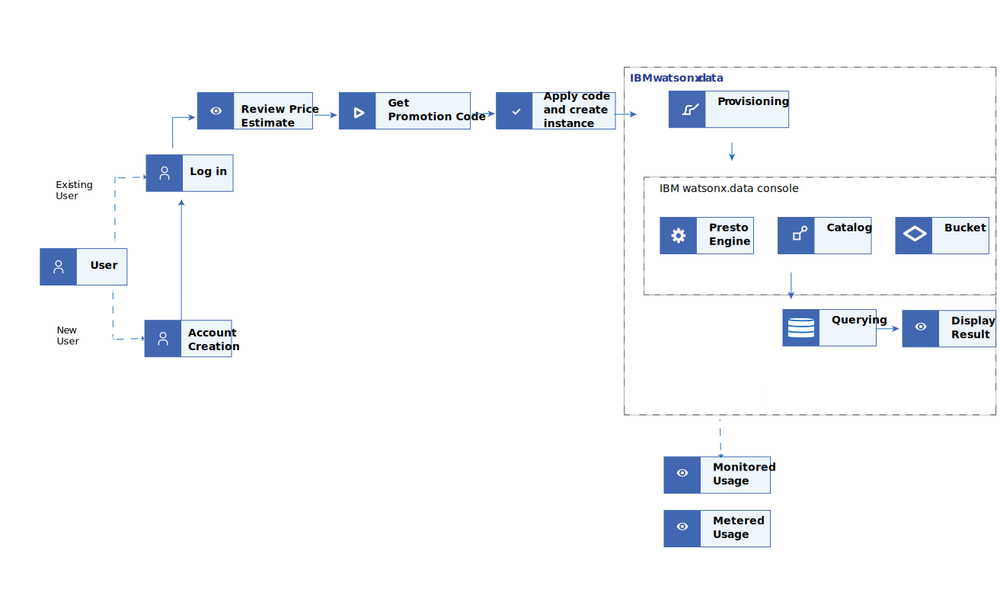

---

copyright:
  years: 2022, 2023
lastupdated: "2023-07-07"

keywords: watsonx.data, promotion, credits, offers

subcollection: watsonxdata

content-type: tutorial
account-plan: paid
completion-time: 6h
---


{{site.data.keyword.attribute-definition-list}}


{:step: data-tutorial-type="step"}
{:shortdesc: .shortdesc}


# Allowing trial experience
{: #tutorial_hp_intro}
{: toc-content-type="tutorial"}
{: toc-completion-time="6h"}


IBM provides promotion credits to allow a trial experience. The promotion code is sized to allow free trial of {{site.data.keyword.lakehouse_full}} for seven days, if you carefully follow the tutorial. In this trial, you can explore and familiarize yourself with {{site.data.keyword.lakehouse_short}}.
{: shortdesc}

In this tutorial you learn how to claim your free promo code, apply it, monitor the usage of the credit, get started, size your starter instance of {{site.data.keyword.lakehouse_short}} and try it out.
For more information, you can also watch the [watsonx.data demo: Get started with watsonx.data](https://mediacenter.ibm.com/media/watsonx.data+demoA+Get+started+with+watsonx.data/1_brvv64az).

After you fully use the promo credits, you are automatically billed at the advertised rate. So, watch the usage and consumption of the promotion code credits closely.
{: important}

## Objective
{: #hp_obj}

* Getting the promotion code
* Monitoring the promotion credit usage
* Getting started with {{site.data.keyword.lakehouse_short}}
* Loading data
* Querying data

{: caption="Figure 1. User journey" caption-side="bottom"}

## Before you begin
{: #hp_byb}

* To use the promotion credits, you must have an {{site.data.keyword.Bluemix_short}} account with a payment method added.

## Exploring key features
{: #hp_get_explore}
{: step}

Explore and review the following information in the **{{site.data.keyword.lakehouse_short}} {{site.data.keyword.Bluemix_short}} catalog** page.

### Viewing promotion code
{: #hp_view}

To view the promotion code and to know about the free credits, follow the steps:

1. Go to the **{{site.data.keyword.lakehouse_short}}** **{{site.data.keyword.Bluemix_short}} catalog** page.
1. The **Summary** section displays an information dialog box with the promotion code and the free credits information.

### Review price estimate and plan resource
{: #hp_review}

Your {{site.data.keyword.lakehouse_short}} features an elastic scalable computation method with cost per hour that is computed in Resource Units per Hour (RU/Hr). The cost varies depending on the resources that you add. It is important to right size the resources so that you can maximize the promotion credits. Take the time to carefully review the section and select minimum resources to conserve your promotion credits.
You can estimate the Resource Unit per Hour consumption of your starter sized {{site.data.keyword.lakehouse_short}} by using the pricing estimator in the **About** tab on the **{{site.data.keyword.lakehouse_short}}** **{{site.data.keyword.Bluemix_short}} catalog** page.


Here, you learn how to review the price estimate and plan the resources.

1. Go to the **{{site.data.keyword.lakehouse_short}}** **{{site.data.keyword.Bluemix_short}} catalog** page.
1. Select the **About** tab.
1. You can read through the **Summary** and **Features**.
1. In the **Pricing estimator**, you can provide the following inputs and review the **Estimate summary** so that you can assess the hourly cost for the resource units added.

The provisioning of your engine with the infrastructures
(bucket, database) happens after you create the {{site.data.keyword.lakehouse_short}} instance. For more information about provisioning, see [Getting started](#hp_start). The price estimation helps you to have an idea of the hourly resource consumption before you create the {{site.data.keyword.lakehouse_short}} instance.
{: important}


   | Field | Description |
   |--------------------------|----------------|
   |Coordinator node type | Select either **storage optimized** or **compute optimized**. Recommend **storage optimized** to reduce promo credit consumption. |
   |Number of coordinator nodes |By default, it is one.|
   |Resource units|Displays the cost per hour for the type and number of coordinator nodes that you selected|
   |Worker node type | Select either storage optimized or **compute optimized**. Recommend **storage optimized** to reduce promo credit consumption.|
   |Number of worker nodes|By default, it is one. Select the required number of worker nodes. Adding more worker nodes increases the cost per hour and the consumption of your promo code credit. |
   {: caption="Table 1. Pricing Estimator" caption-side="bottom"}

   If you add more than one worker nodes, engines or if you choose compute optimized, the cost per hour increases and drains the promo code credit. For the trial, it is recommended to go with a single Presto engine (memory or storage optimized) that has one head node and one worker node.
   {: important}

   Support services are required and cannot be turned off. They consume 3 RU/Hr.
   A Presto engine (memory or storage optimized) with one head node and one worker node each consumes 2.8 RU/Hr.
   {: note}

1. After configuring the resources from the **Pricing Estimator** details, you can scroll to the **Estimate summary** for the total estimated cost per hour.

    Example:
    For a sample configuration below, the total cost estimate is : 8.6 RU/Hr.

    | Field | Field values |
    |--------------------------|----------------|
    | Coordinator node type | **Storage optimized** |
    | Number of coordinator nodes |**1**|
    |Resource units| Displays 2.8 RU/Hr|
    | Worker node type | **Storage optimized**|
    |Number of worker nodes|**1** |
    |Resource units| Displays 2.8 RU/Hr|
    {: caption="Table 1. Sample Configuration" caption-side="bottom"}

The following image displays **{{site.data.keyword.lakehouse_short}}** **{{site.data.keyword.Bluemix_short}} catalog** page.

{: caption="Figure 2. Price estimator" caption-side="bottom"}

The following are some of the scenarios to illustrate consumption of promotion credits, an example case of $1,500.

* If you leave the query engine in the running state, with a head node and a worker node for the entire day, then the cost estimate is 8.6 RU/Hrs * 24 Hrs = 206.4 RU/Day. At this rate there would be seven days until the promo code is consumed and billing begins automatically.

* If you leave the engine paused without resuming, the support services still continue to have 3 RU/Hr in cost per hour to maintain your support services. This consumes the promo credit within 20 days even though the engine was paused.


Best practice:

* For the trial, pause the engine whenever you are not using it for queries.
* For the trial, it is recommend to go with a single Presto engine (memory or storage optimized) that has one head node and one worker node.
* If you choose not to continue, buy and build on with your {{site.data.keyword.lakehouse_short}} you must manually delete your instance from the resource list before the promo credits are consumed. For more information about how to delete an instance, see [Viewing Usage](#hp_monitor_usg)

## Applying the promotion code
{: #hp_get_promo}
{: step}

In this section of the tutorial, you are going to learn how to apply the promotion code.


1. Go to the **{{site.data.keyword.lakehouse_short}}** **{{site.data.keyword.Bluemix_short}} catalog** page.
1. Select the **Create** tab.
1. Select {{site.data.keyword.Bluemix_short}} as the cloud platform to deploy {{site.data.keyword.lakehouse_short}}.

1. Select a location from the list of available locations for {{site.data.keyword.lakehouse_short}} service.

1. Enter the service name. The service name can be any string. This service name is used in the web console to identify the new deployment.

1. Select a resource group. If you are organizing your services into resource groups, specify the resource group.(optional).

1. Enter a tag name. This is optional.

1. Select the type of network endpoints that is used for accessing the service.(optional).

   a. **Public endpoint only** - Public endpoints provide a connection to your deployment on the public network (single endpoint).

   b. **Private endpoint only** - Private endpoints route traffic through the {{site.data.keyword.Bluemix_short}} Private network (single endpoint).

   c. **Both public and private endpoints** - Public endpoints provide a connection to your deployment on the public network. Private endpoints route traffic through the {{site.data.keyword.Bluemix_short}} Private network. (two separate endpoints).

1. In the **Summary** pane, the promotion code appears.
1. Enter the promotion code in the **Apply a code** field and click **Apply**.
1. Review the license agreement and select the checkbox to acknowledge the agreement.
1. Click **Create**. The **{{site.data.keyword.Bluemix_short}} manage resource** page is displayed.

   After you click **Create**, the message stating that the “instance is being provisioned” is displayed and you are taken to the **Resource list**. From the **Resource list**, under **Databases** category, you can see that the status for your instance is, **Provision in progress**.

1. Select the instance when the status changes to **Active**.

1. Go to **Resource list** **>** **Databases**.

1. Click your {{site.data.keyword.lakehouse_short}} instance link. The service instance page opens.

1. Click **Open web console** to start the web console.

1. Log in to the console with your IBMid and password. The {{site.data.keyword.lakehouse_short}} web console opens.

You can also apply the promotion code directly from your {{site.data.keyword.Bluemix_short}} promo credit dashboard.
{: note}


## Setting spending notification
{: #hp_spend_noti}
{: step}

You can set up email spending notifications. You receive notifications when you reach 80%, 90%, and 100% of the spending thresholds that you specify.


Promotion code consumption does not trigger spend notifications. You can trigger spending notification only after the promo code is consumed. You must choose an amount that you are comfortable spending after the promo code is consumed. Spend notifications trigger on an hourly basis after promo credit is consumed. For example, if you set a spend notification of $20, you receive a notification within 2 hours after the full consumption of the promo credit (for example $1,500).
{: important}

1. In the {{site.data.keyword.Bluemix_short}} console, go to **Manage** > **Billing and usage**, and select **Spending notifications**.
2. Set the **Enable** option to on for the specific service area to enable email notifications.
3. Click the **Edit** option from the **Actions** icon.
4. Next, you can add email recipients. You can select up to 10 users from your {{site.data.keyword.Bluemix_short}} account to receive email notifications about a service.
5. Enter the dollar amount to set a spending threshold.
6. When you are finished, click **Save** to save your changes.

## Viewing usage
{: #hp_monitor_usg}
{: step}

You can also monitor the promotion credit usage level and plan subscription in the {{site.data.keyword.Bluemix_short}} Console.


1. In the {{site.data.keyword.Bluemix_short}} console, go to **Manage** > **Billing and usage**. Select **Promotions and credits**.
1. Click a promotion to expand the table and view a description of each promotion and the products it applies to.
1. If your promo credits are exhausted and you do not want to continue paying, you must manually delete your {{site.data.keyword.lakehouse_short}} instance by following the steps:

    1. Log in to your {{site.data.keyword.Bluemix_short}} account.

    1. From the **Resource** list, select your deployment.

    1. Click **Delete** from the list.


## Getting started with {{site.data.keyword.lakehouse_short}}
{: #hp_start}
{: step}

When you log in to the {{site.data.keyword.lakehouse_short}} web console for the first time, you are presented with the quick start wizard.


Use the quick start wizard to configure the basic settings and get started with {{site.data.keyword.lakehouse_short}} in a few minutes.

In this section of the tutorial, you perform the following:
* Register the details of the object storage bucket.
* Add the metadata catalogs to manage your table schemas.
* Select the query engine to work with your data.


Complete the following steps:

1. In the **Bucket configuration** page, select **Provision new IBM-managed bucket**.
2. Click **Next**. This displays the **Catalogs configuration** page.
3. In the **Catalogs configuration** page, select a catalog.
4. Click **Next**. This displays the **Engine configuration** page.
5. In the **Engine configuration** page, select the **Presto engine** and smallest starter (1 coordinator node 1 worker node memory optimized).
6. Click **Next**. This displays the **Summary** page.
7. In the **Summary** page, review the configurations before you finish setting up your data infrastructure.

   When the setup is complete, the {{site.data.keyword.lakehouse_short}} home page is displayed.
   You are all set to use the {{site.data.keyword.lakehouse_short}} or you can configure it further.

8. Click **Finish and go**. This displays the **Infrastructure manager** page.

Although you can add more engines, catalogs, buckets, and databases in the **Infrastructure manager** page if you want to, this would change the consumption rate of your promo code. When you add items in the **Infrastructure manager**, you can see the resource unit consumption per hour.
{: note}

The promotion credits consumption begins immediately after you configure and the support services are created for your metadata.
Ensure that you pause the Presto engine when it is not used. This helps in optimizing the usage credit.
{: important}

## Ingesting data
{: #hp_ingest}
{: step}


The data files are ingested into {{site.data.keyword.lakehouse_short}} using CLI. For the steps to perform ingestion, see the [Ingesting data through the command-line interface (CLI)](watsonxdata?topic=watsonxdata-ingest_data_cli){: external}
<!--
1. Log in to the {{site.data.keyword.lakehouse_short}} console.
1. Open **Ingestion hub** from the navigation menu.
1. Click **Create ingestion job**. Drag the files to the rectangle box or click to upload.
1. If required, make the necessary changes in the **Configure** options section and click **Next**. You can also preview the file that is uploaded.
1. In the **Target** form, select the query engine, the target table, catalog, and schema for the file you are ingesting.
1. Enter a name for the table in the **Table** field and click **Next**.
1. Verify the details in the **Summary** page and click **Ingest**. -->

## Querying data
{: #hp_qury}
{: step}

In this section of the tutorial, you learn how to navigate to the **Query workspace**, and create SQL queries to query your data from the bucket.


To run the SQL queries, do the following steps:

1. From the navigation menu, select **SQL**.  The **Query workspace** page opens.
2. Select the Presto engine from the **Engine** drop-down.
3. Select a catalog, for example, **default** schema, and a table, for example, **order_detail**, to run the query.
4. Click the overflow menu and select the required query.
   * For a catalog and schema, you can run the Generate Path query.
   * For a table, you can run the Generate path, Generate SELECT, Generate ALTER, and Generate DROP query.
   * For a column, you can run the Generate path, Generate SELECT, and Generate DROP query.

   Consider the following sample query to view the details from the table:

   Example:

   ```bash
   #!/bin/bash
   SELECT * FROM "iceberg-beta"."default"."order_detail" LIMIT 10;
   ```
   {: codeblock}

5. Click **Run on** to run the query.
6. Select **Result set** or **Details** tab to view the results. If required, you can save the query.
7. Click **Saved queries** to view the saved queries.
8. Click [**Explain**](watsonxdata?topic=watsonxdata-explain_sql_query){: external} to view the logical or distributed plan of execution for a specified SQL query.

## Keep exploring
{: #hp_future}
{: step}

1. Explore the other tutorials in the documentation.
1. Monitor the promo code consumption to decide whether to buy, build on (default), decline or manually delete your instance.
