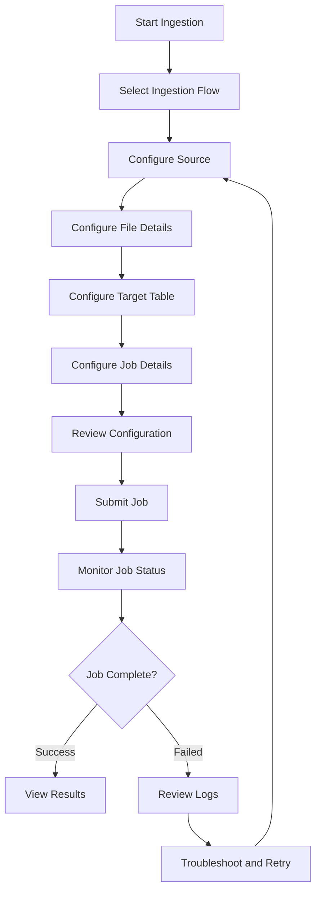

---

copyright:
  years: 2022, 2025
lastupdated: "2026-04-06"

keywords: {{site.data.keyword.lakehouse_short}}, data ingestion, source file

subcollection: watsonxdata

---

{:javascript: #javascript .ph data-hd-programlang='javascript'}
{:java: #java .ph data-hd-programlang='java'}
{:ruby: #ruby .ph data-hd-programlang='ruby'}
{:php: #php .ph data-hd-programlang='php'}
{:python: #python .ph data-hd-programlang='python'}
{:external: target="_blank" .external}
{:shortdesc: .shortdesc}
{:codeblock: .codeblock}
{:screen: .screen}
{:tip: .tip}
{:important: .important}
{:note: .note}
{:deprecated: .deprecated}
{:pre: .pre}
{:video: .video}

# Ingesting data by using the Spark ingestion UI
{: #ingest_spark_ui_new}

You can ingest data from various sources into {{site.data.keyword.lakehouse_full}} by using the Spark ingestion user interface. The Spark ingestion UI provides a guided workflow to configure and run ingestion jobs.

## Ingestion flow types
{: #ingest_spark_ui1}

The Spark ingestion UI supports the following ingestion flows:

- **[Local system](/docs/watsonxdata?topic=watsonxdata-ingest_spark_local)** - Upload and ingest files from your local machine
- **[Remote storage](/docs/watsonxdata?topic=watsonxdata-ingest_spark_storage)** - Ingest data from cloud storage systems (Amazon S3, IBM Cloud Object Storage, Azure Data Lake Storage, Google Cloud Storage, MinIO)
- **[Database](/docs/watsonxdata?topic=watsonxdata-ingest_spark_database)** - Ingest data from external databases (Db2, MySQL, PostgreSQL, Teradata)
- **[Spark Stream (Experimental)](/docs/watsonxdata?topic=watsonxdata-ingest_spark_stream)** - Ingest streaming data using Spark Structured Streaming
- **[Delta Lake source](/docs/watsonxdata?topic=watsonxdata-ingest_spark_deltalake)** - Ingest data from Delta Lake tables

## Ingestion workflow
{: #ingest_spark_ui2}

The following diagram illustrates the common workflow for all ingestion flows:

{: screen}

## Prerequisites
{: #ingest_spark_ui3}

Before you begin ingesting data, ensure that you meet the following prerequisites:

- You must have the **Admin** or **User** role to access the Spark ingestion UI.
- A Spark engine must be provisioned and running in your {{site.data.keyword.lakehouse_short}} instance.
- For database ingestion, the source database must be accessible from the {{site.data.keyword.lakehouse_short}} environment.
- For remote storage ingestion, you must have the appropriate credentials and permissions to access the storage system.
- For Delta Lake ingestion, the Delta Lake source must be registered in {{site.data.keyword.lakehouse_short}}.

## Common procedures
{: #ingest_spark_ui4}

The following procedures are common across all ingestion flows:

### Accessing the Spark ingestion UI
{: #ingest_spark_ui5}

1. Log in to the {{site.data.keyword.lakehouse_short}} console.
2. From the navigation menu, select **Data manager**.
3. Click **Ingest data**.
4. Select the appropriate ingestion flow based on your data source.

### Configuring target table settings
{: #ingest_spark_ui6}

When configuring the target table for ingestion, you can specify the following settings:

- **Catalog**: Select the catalog where the target table will be created or updated.
- **Copy-on-Write**: Toggle to enable or disable Copy-on-Write mode for Iceberg tables. When enabled, the table uses Copy-on-Write format; when disabled, it uses Merge-on-Read format.
- **Schema**: Select or create a schema within the catalog. Click the **Create +** button to create a new schema.
- **Table name**: Specify the name for the target table.
- **Table format**: Choose the table format (Iceberg, Hive, or Delta Lake).
- **Write mode**: Select how data should be written to the target table:
   - **Append**: Add new data to the existing table.
   - **Overwrite**: Replace all existing data in the table.
   - **ErrorIfExists**: Fail the job if the table already exists.
   - **Ignore**: Skip the ingestion if the table already exists.

To ensure the ingestion is accurate and consistent with source data, all input schemas must be identical or compatible with the target table schema.
{: note}

### Configuring job details
{: #ingest_spark_ui7}

When configuring job details, you can specify the following settings:

- **Job ID**: A unique identifier is automatically generated for each ingestion job.
- **API key (optional)**: Enter an API key if required for authentication. This is mandatory for streaming jobs.
- **Spark engine**: Select the Spark engine to use for the ingestion job. Options include:
   - **Lite ingestion**: Available for files smaller than 2 MB (Local system only)
   - **(Spark) Spark**: Standard Spark engine for larger files and all other ingestion flows
- **Job size**: Select the resource allocation for the job:
   - **Local**: Minimal resources for small datasets
   - **Small**: Small resource allocation
   - **Medium**: Medium resource allocation
   - **Large**: Large resource allocation for big datasets
- **Executor cores**: Specify the number of CPU cores per executor.
- **Executor memory**: Specify the amount of memory per executor.
- **Number of executors**: Specify the number of executors to use for the job.
- **Driver cores**: Specify the number of CPU cores for the driver.
- **Driver memory**: Specify the amount of memory for the driver.

The default values for Spark configuration are optimized for most use cases. Adjust these values only if you have specific performance requirements.
{: note}

### Monitoring ingestion jobs
{: #ingest_spark_ui8}

After submitting an ingestion job, you can monitor its progress:

1. From the **Data manager** page, click **View jobs**.
2. Locate your ingestion job in the list.
3. Click the job name to view detailed information, including:
   - Job status (Running, Completed, Failed)
   - Start and end times
   - Execution logs
   - Error messages (if applicable)

## Related information
{: #ingest_spark_ui9}

- [Managing Spark engines](link-to-spark-engines.md)
- [Working with catalogs and schemas](link-to-catalogs.md)
- [Monitoring jobs](link-to-monitoring.md)
