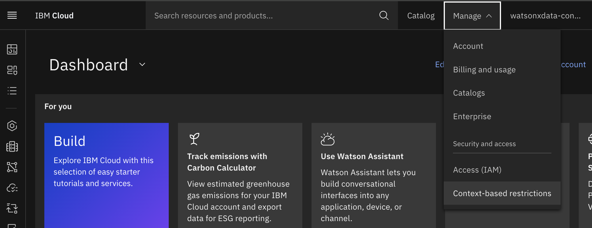
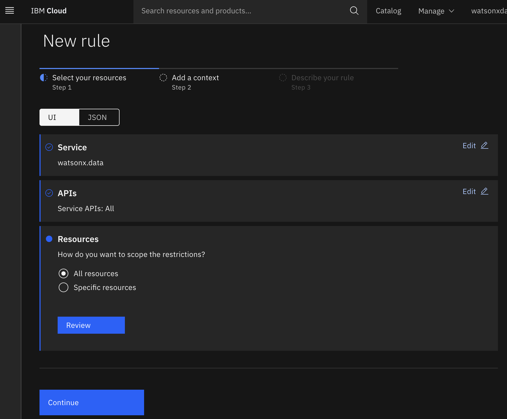
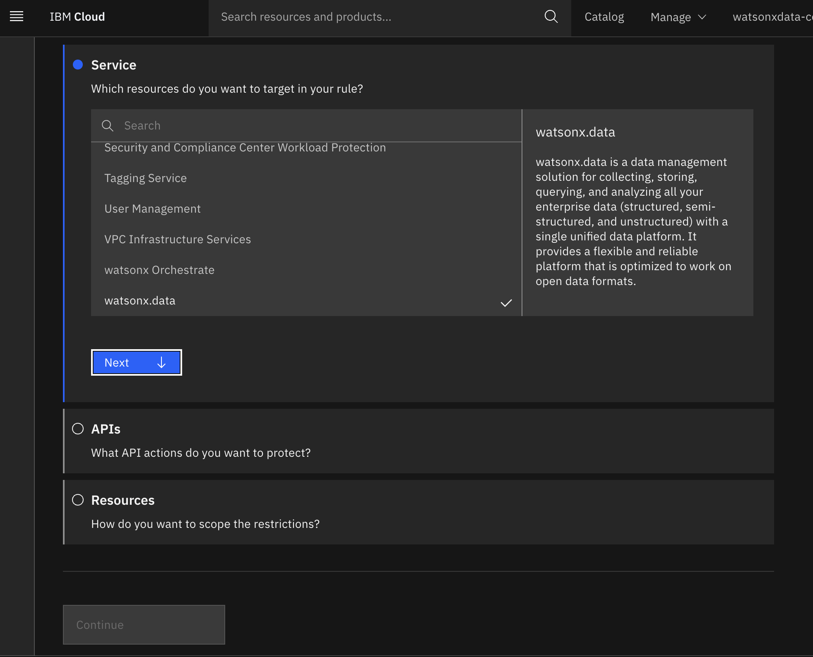
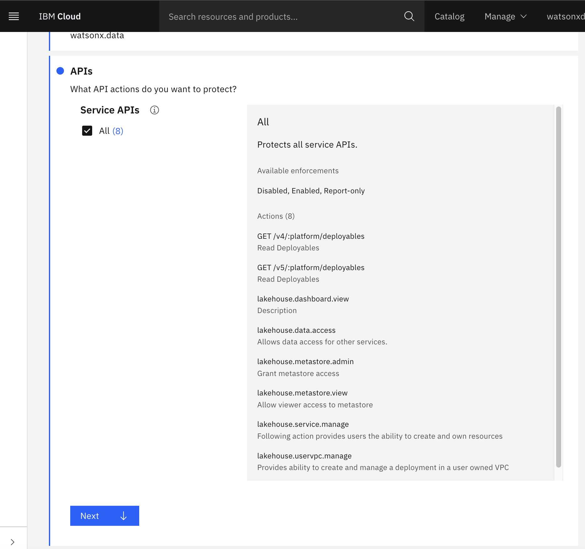
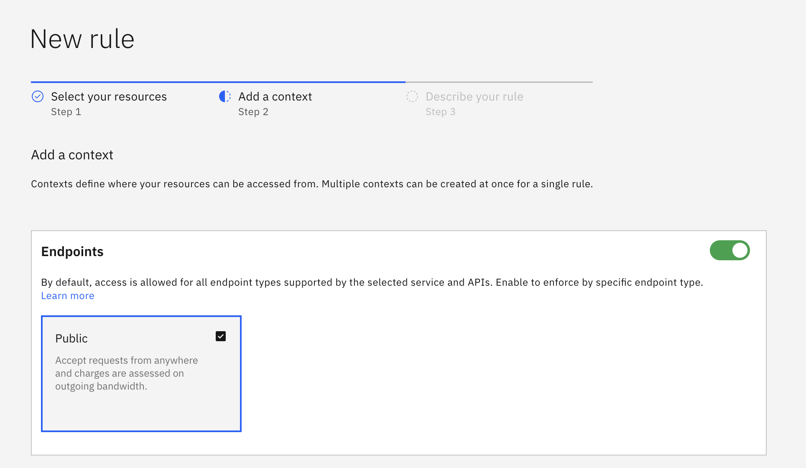
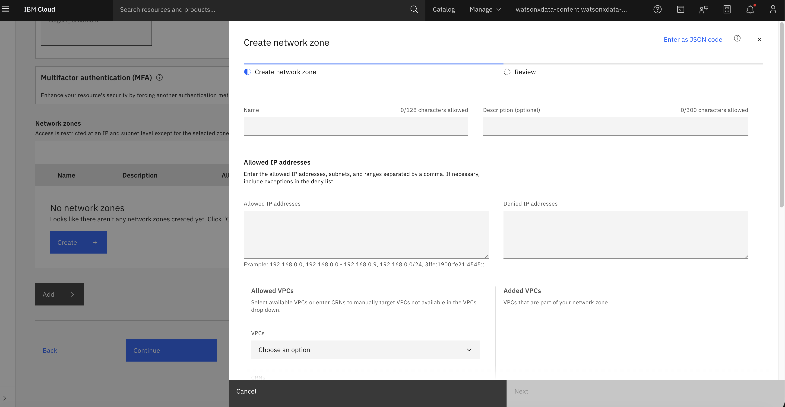
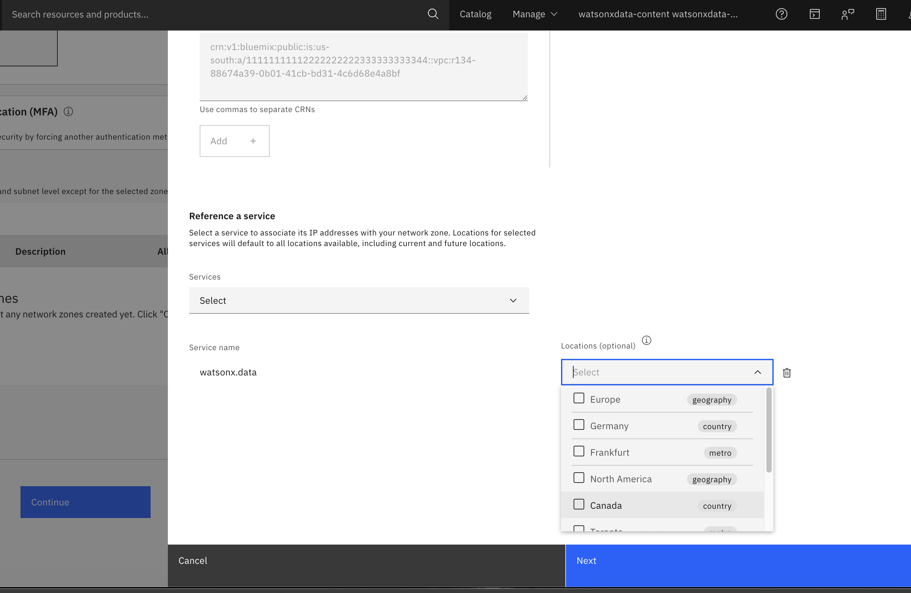
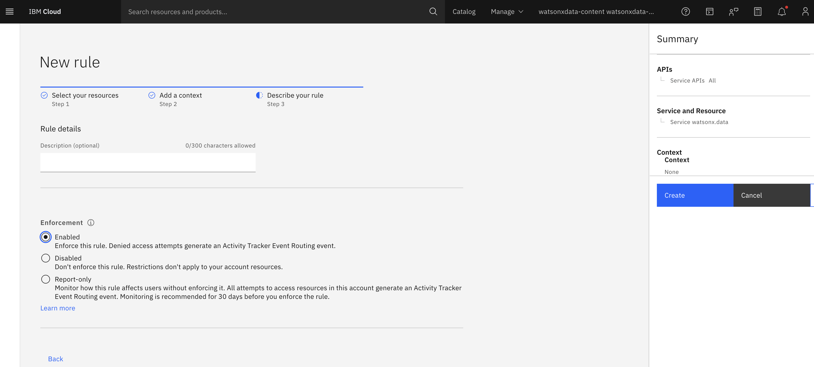

---

copyright:
  years: 2022, 2025
lastupdated: "2026-02-20"

keywords: access, access control, access management

subcollection: watsonxdata

---

{:javascript: #javascript .ph data-hd-programlang='javascript'}
{:java: #java .ph data-hd-programlang='java'}
{:ruby: #ruby .ph data-hd-programlang='ruby'}
{:php: #php .ph data-hd-programlang='php'}
{:python: #python .ph data-hd-programlang='python'}
{:external: target="_blank" .external}
{:shortdesc: .shortdesc}
{:codeblock: .codeblock}
{:screen: .screen}
{:tip: .tip}
{:important: .important}
{:note: .note}
{:deprecated: .deprecated}
{:pre: .pre}
{:video: .video}

# Securing UI Access with IP-Based Controls
{: #access_rest}

This topic explains how to configure trusted IP addresses for UI and API access, allowing administrators to define which IP address can interact with specific user interface and API components. By implementing IP-based access controls, you can add an extra layer of protection, ensuring that only traffic from approved IP ranges can access {{site.data.keyword.lakehouse_short}}. For more information, see [What are context-based restrictions?](https://cloud.ibm.com/docs/account?topic=account-context-restrictions-whatis).
{: shortdesc}

## Before you begin
{: #access_bfb}

To configure trusted IP addresses for UI access, you must have Administrator privileges for the account.

## Configuring trusted IP access
{: #level_ipaddrs}

1. Sign in to IBM Cloud. Log in to your IBM Cloud account.

2. From the IBM Cloud Console, navigate to **Manage > Context-based restrictions**.

   {: caption="Access CBR" caption-side="bottom"}

3. From the Navigation pane, click **Rules**.

4. Click **Create+**. The **New rule** page opens. Select {{site.data.keyword.lakehouse_short}} service from the list.

   {: caption="Create rule" caption-side="bottom"}

   {: caption="New rule" caption-side="bottom"}

5. Click **Next**. Select all **APIs**. Define the APIs that you want to protect to narrow the scope of a rule's restrictions. See [Defining the scope of a rule](/docs/watsonxdata?topic=account-context-restrictions-whatis&interface=ui#rule-scope).

   {: caption="Specify APIs" caption-side="bottom"}

6. Click **Next**. From **Resources**, select **Specific resource** option and choose {{site.data.keyword.lakehouse_short}}. You can review the selection.

7. Click **Continue**. Specify the contexts from where your resource can be accessed.  See [Contexts](/docs/watsonxdata?topic=account-context-restrictions-whatis&interface=ui#restriction-context).

Turn **On** the Endpoints to specify the endpoint that receives the connection. Only Public endpoints are supported.

   {: caption="Endpoints" caption-side="bottom"}

From the **Network zones**, click **Create** and provide the list of IP addresses in the **Allowed IP addresses** field. See .

   {: caption="Network" caption-side="bottom"}

8. From the **Reference a service** section, select {{site.data.keyword.lakehouse_short}} as the service. Click **Continue**.

   {: caption="Network" caption-side="bottom"}

9. You can decide how you want to enforce a rule upon creation and update the rule enforcement at any time. See [Rule enforcement](/docs/watsonxdata?topic=account-context-restrictions-whatis&interface=ui#rule-enforcement).

   {: caption="Enforcement" caption-side="bottom"}

10. Click **Create**. The rule is created successfully.

   For more information, see [Creating context-based restrictions](https://cloud.ibm.com/docs/account?group=controlling-context-based-restrictions) and [Enforcing context-based restrictions](https://cloud.ibm.com/docs/account?topic=account-context-restrictions-create&interface=ui).

## Limitation
{: #limit_cbr}

`Context-based restrictions` does not work for account-scoped lite instances.
