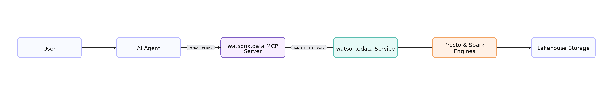

---

copyright:
  years: 2022, 2025
lastupdated: "2026-03-03"

keywords: lakehouse, watsonx.data, query optimizer, install

subcollection: watsonxdata

---

{:javascript: #javascript .ph data-hd-programlang='javascript'}
{:java: #java .ph data-hd-programlang='java'}
{:ruby: #ruby .ph data-hd-programlang='ruby'}
{:php: #php .ph data-hd-programlang='php'}
{:python: #python .ph data-hd-programlang='python'}
{:external: target="_blank" .external}
{:shortdesc: .shortdesc}
{:codeblock: .codeblock}
{:screen: .screen}
{:tip: .tip}
{:important: .important}
{:note: .note}
{:deprecated: .deprecated}
{:pre: .pre}
{:video: .video}

# Querying data through agents by using the MCP server
{: #squerying-data-ai}

The IBM {{site.data.keyword.lakehouse_short}} Model Context Protocol (MCP) Server enables agents to interact with IBM {{site.data.keyword.lakehouse_short}}lakehouse instances through natural language interfaces. You can use this server to securely access and explore your lakehouse data and metadata through the Model Context Protocol, with built-in read-only protection to ensure data integrity.

## Architecture overview
{: #squerying-data-ai-ar}

The following diagram illustrates the high-level architecture of the IBM {{site.data.keyword.lakehouse_short}} MCP Server:

{: caption="Figure 1. Architecture diagram" caption-side="bottom"}{: width="1500px"}

The architecture consists of the following components:

1. **User** - The end user who interacts with the AI assistant
2. **AI Agent** - The client application (such as Claude Desktop or IBM Bob) that provides the natural language interface
3. **watsonx.data MCP Server** - The secure bridge that:
   - Communicates with the AI assistant through stdio/JSON-RPC protocol
   - Manages IAM authentication and API calls
   - Translates natural language requests into watsonx.data operations
4. **watsonx.data Service** - The lakehouse service that processes requests
5. **Presto & Spark Engines** - The query engines that execute SQL queries
6. **Lakehouse Storage** - The underlying data storage layer

## Who should use the MCP Server
{: #squerying-data-ai-us}

The IBM {{site.data.keyword.lakehouse_short}} MCP Server is designed for the following users:

- AI agent developers who are building data-aware assistants
- Platform teams who are enabling governed AI access to lakehouse data
- Users who want conversational querying without exposing write access

## Terminology
{: #squerying-data-ai-tr}

- Agent: An AI system that reasons and acts (for example, Claude, IBM Bob, or custom agent).
- MCP Server: A secure bridge between an agent and {{site.data.keyword.lakehouse_short}}.
- MCP Tool: The callable interface that is exposed by the MCP Server.

## Features and capabilities
{: #squerying-data-ai-ft}

The IBM {{site.data.keyword.lakehouse_short}} MCP Server provides the following capabilities:

**Data access and exploration**
{: #squerying-data-ai-dt}

- Execute SQL SELECT queries using natural language or direct SQL syntax
- Browse data catalogs and schemas
- Inspect table structures and metadata
- Monitor engine status and availability

**Security features**
{: #squerying-data-ai-se}

- Read-only access enforcement (SELECT queries only)
- IBM Cloud Identity and Access Management (IAM) authentication
- Automatic token refresh mechanism
- Query validation and safety checks

**Transport mechanisms**
{: #squerying-data-ai-trm}

- stdio transport for local subprocess communication. For implementation guidelines and security best practices, refer [MCP Transports Specification](https://modelcontextprotocol.io/specification/2025-11-25/basic/transports).

## System requirements
{: #squerying-data-ai-sq}

**Software prerequisites**
{: #squerying-data-ai-sp}

Before you begin, ensure that your system meets the following requirements:

| Component | Requirement | Notes |
|-----------|-------------|-------|
| Python | Version 3.11 or later | [Download Python](https://www.python.org/downloads/) |
| Package manager | uv | [Install uv](https://github.com/astral-sh/uv) |
| IBM Cloud account | Active account | [Register for IBM Cloud](https://cloud.ibm.com/registration) |
{: caption="System requirements" caption-side="bottom"}

**IBM {{site.data.keyword.lakehouse_short}}requirements**
{: #squerying-data-ai-reqi}

You must have access to the following IBM {{site.data.keyword.lakehouse_short}} resources:

- **{{site.data.keyword.lakehouse_short}} instance**: A provisioned and running instance

   - [Provision a lite plan instance](https://cloud.ibm.com/docs/watsonxdata?topic=watsonxdata-tutorial_prov_lite_1) and [Provision an enterprice plan instance](https://cloud.ibm.com/docs/watsonxdata?topic=watsonxdata-getting-started_1)

   - [Set up {{site.data.keyword.lakehouse_short}} lite plan](https://cloud.ibm.com/docs/watsonxdata?topic=watsonxdata-tutorial_hp_intro)

- **IBM Cloud API key**: An API key with appropriate permissions

   - [Create an API key](https://cloud.ibm.com/iam/apikeys)

**Required configuration information**
{: #squerying-data-ai-cnf}

Collect the following information before installation:

- **Base URL**: The URL of your {{site.data.keyword.lakehouse_short}} instance
   - Format: `"https://your-instance.lakehouse.cloud.ibm.com/lakehouse/api/lakehouse/api`

- **Instance CRN**: The Cloud Resource Name of your instance. To find CRN, refer [Getting connection information](https://cloud.ibm.com/docs/watsonxdata?topic=watsonxdata-get_connection).

   - Format: `crn:v1:bluemix:public:lakehouse:us-south/a/...`

   - To locate your Instance CRN:

    1. Log in to the {{site.data.keyword.lakehouse_short}} console.
    2. On the **Instance details** or **Configuration** page, locate the **CRN** field in the details section.
    3. Click the copy icon next to the CRN to copy it to your clipboard.

- **IAM API Key**: Your IBM Cloud API key with {{site.data.keyword.lakehouse_short}} access permissions.

## Installing the MCP server
{: #squerying-data-ai-inm}

You can install the IBM {{site.data.keyword.lakehouse_short}} MCP Server using one of the following methods:

### Installing with pipx
{: #squerying-data-ai-pix}

1. Run the following code to install pipx if not already installed.

   ```bash
   pip install pipx
   ```
   {: codeblock}

2. Run the following code to install the MCP server.

   ```bash
   pipx install ibm-watsonxdata-mcp-server
   ```
   {: codeblock}


### Installing with pip
{: #squerying-data-ai-pip}

Use this method if you prefer to install the server in your user Python environment.

1. Run the following code to install the MCP server.

   ```bash
   pip install --user ibm-watsonxdata-mcp-server
   ```
   {: codeblock}

To install MCP sever for development setup, refer [IBM {{site.data.keyword.lakehouse_short}} MCP Server](https://github.com/IBM/ibm-watsonxdata-mcp-server?tab=readme-ov-file).

## Configuring the MCP server
{: #squerying-data-ai-cnf}

After installation, configure your agents to communicate with the MCP server.

### Find the MCP server executable
{: #squerying-data-ai-srv}

Complete the steps below to locate the MCP server executable based on your operating system. You will use this path when configuring your agents.

- **macOS or Linux**

   Open a terminal and run:

   ```bash
   which ibm-watsonxdata-mcp-server
   ```
   {: codeblock}

- **Windows (PowerShell)**

   Open PowerShell and run:

   ```bash
   where.exe ibm-watsonxdata-mcp-server
   ```
   {: codeblock}

### Connect your Agents with MCP Server
{: #squerying-data-ai-caw}

After locating the MCP server executable, configure your agents to connect to the server. See the following topics for specific instructions:

- [Configuring Claude Desktop](../wx-data/configuring-claude.html)
- [Configuring IBM Bob](../wx-data/configuring-bob.html)

### Working with the MCP Tool
{: #squerying-data-ai-wrkm}

The following topic provides detailed guidance on using the MCP server tools to interact with your {{site.data.keyword.lakehouse_short}} instance.

- [Working with the MCP Tool](../wx-data/working_with_MCP_server.html)

## Limitations
{: #squerying-data-ai-lti}

The IBM {{site.data.keyword.lakehouse_short}} MCP Server has the following limitations:

### Unsupported database operations
{: #squerying-data-ai-un}

The MCP server enforces read-only access to protect data integrity and security. The following operations are not supported:

- **INSERT statements:** Cannot add new records to tables
- **UPDATE statements:** Cannot modify existing data
- **DELETE statements:** Cannot remove data from tables
- **DDL statements:** Cannot create, alter, or drop database objects (tables, schemas, views, indexes)

### Query validation and execution restrictions
{: #squerying-data-ai-qv}

The MCP server implements automatic query validation to ensure safe execution:

- **Query type enforcement:** Only SELECT queries are permitted
- **Pre-execution validation:** All queries are validated before execution
- **Harmful operation blocking:** Potentially unsafe operations are blocked during the validation phase

### Accessible metadata
{: #squerying-data-ai-accm}

The MCP server provides access to the following metadata for data exploration and query construction:

- **Instance information:** Version, connection status, and available engines
- **Engine details:** Names, types, and operational status
- **Schema and catalog information:** Available databases and schemas
- **Table structures:** Columns, data types, properties, partitioning, and primary keys
