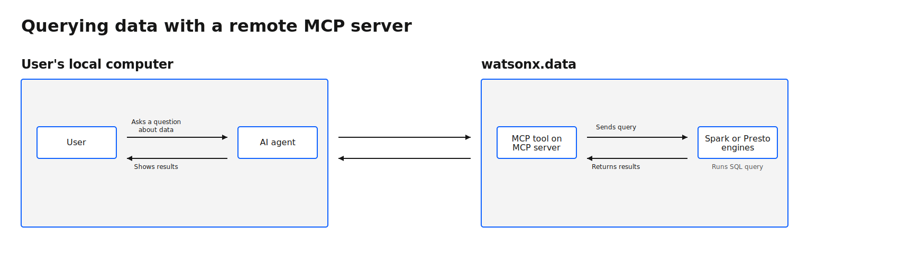
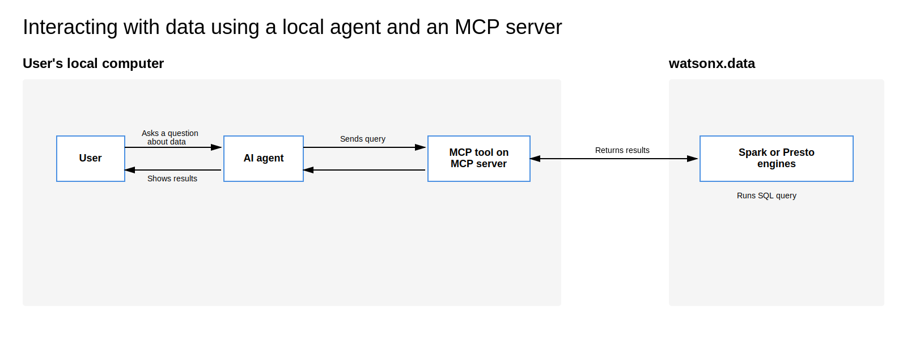

---

copyright:
  years: 2022, 2025
lastupdated: "2026-04-07"

keywords: lakehouse, watsonx.data, query optimizer, install

subcollection: watsonxdata

---

{:javascript: #javascript .ph data-hd-programlang='javascript'}
{:java: #java .ph data-hd-programlang='java'}
{:ruby: #ruby .ph data-hd-programlang='ruby'}
{:php: #php .ph data-hd-programlang='php'}
{:python: #python .ph data-hd-programlang='python'}
{:external: target="_blank" .external}
{:shortdesc: .shortdesc}
{:codeblock: .codeblock}
{:screen: .screen}
{:tip: .tip}
{:important: .important}
{:note: .note}
{:deprecated: .deprecated}
{:pre: .pre}
{:video: .video}

# Interacting with data through an MCP server
{: #querying-data-ai}

You can securely access and explore your lakehouse data and metadata through natural language by using {{site.data.keyword.lakehouse_short}} Model Context Protocol (MCP) server and your AI agent.

The IBM {{site.data.keyword.lakehouse_short}} MCP Server is designed for the following users:

- AI agent developers who are building data-aware assistants
- Platform teams who are enabling governed AI access to lakehouse data
- Users who want conversational querying without exposing write access

## Connection models
{: #querying-data-ai-cm}

{{site.data.keyword.lakehouse_short}} supports two MCP server connection models. You can choose the type of MCP server that best fits your needs. Both types provide the same tools and capabilities.

### Remote MCP server
{: #querying-data-ai-rmcp}

The remote MCP server is a hosted endpoint on IBM Cloud.

### Local MCP server
{: #querying-data-ai-lmcp}

The local MCP server runs on your local machine.

## Capabilities
{: #squerying-data-ai-ft}

The IBM {{site.data.keyword.lakehouse_short}} MCP Server provides the following capabilities:

**Engine management**
{: #querying-data-ai-em}

- Full lifecycle management of Presto and Spark engines (create, update, scale, pause, resume, restart, and delete)
- Engine discovery and status monitoring

**Catalog perations**
{: #querying-data-ai-co}

- Schema and table discovery across catalogs
- Table structure inspection and metadata exploration
- Schema creation and table modifications (rename tables, add/rename columns)

**Query execution**
{: #querying-data-ai-qe}

- Read operations with SELECT queries
- Write operations with INSERT and UPDATE queries (DELETE not supported)
- Query optimization with EXPLAIN and EXPLAIN ANALYZE

**Spark applications**
{: #querying-data-ai-spa}

- Submit and manage Spark jobs (JAR, Python, R)
- Monitor application status and progress
- Control running applications

**Data ingestion**
{: #querying-data-ai-din}

- Bulk data loading from S3/COS (CSV, Parquet, JSON)
- Ingestion job management and monitoring

**Data security**
{: #querying-data-ai-dse}

- IBM Cloud Identity and Access Management (IAM) authentication
- Automatic token refresh mechanism
- Controlled write access (INSERT and UPDATE supported; DELETE operations not permitted)

**Transport mechanisms**
{: #squerying-data-ai-trm}

- **stdio** transport for local subprocess communication
- **Streamable HTTP** for remote server connections

For implementation guidelines and security best practices, refer [MCP Transports Specification](https://modelcontextprotocol.io/specification/2025-11-25/basic/transports).

**AI agent integrations**
{: #squerying-data-ai-aiag}

- Integrates with the following AI agents on your local computer:

   - IBM Bob
   - Claude Desktop
   - Other MCP-compatible clients (only for remote MCP server)

## Configuration workflow
{: #squerying-data-ai-cfwr}

The configuration process varies depending on whether you choose the remote or local MCP server connection model. The remote MCP server requires only the endpoint, while the local MCP server requires installation and local setup before configuration. Follow the workflow that matches your chosen connection model.

**For remote MCP server**
{: #squerying-data-ai-cfwr-frm}

To configure the Remote MCP server, complete these main tasks:

1. [Obtain the endpoint for the remote MCP server](/docs/watsonxdata?topic=watsonxdata-remote-querying-data-ai-end)
2. Configure your AI agent to work with the MCP server and connect to {{site.data.keyword.lakehouse_short}}. See [Configuring IBM Bob](/docs/watsonxdata?topic=watsonxdata-configuring-bob), [Configuring Claude Desktop](/docs/watsonxdata?topic=watsonxdata-configuring-claude), or [Configuring other MCP clients](/docs/watsonxdata?topic=watsonxdata-configuring-other-agents).

**For local MCP server**
{: #squerying-data-ai-cfwr-flm}

To configure the MCP server, complete these main tasks:

1. Install and configure the MCP server on your local computer. See [Installing and configuring the MCP server for querying data](/docs/watsonxdata?topic=watsonxdata-querying-data-ai-inm).
2. Configure your AI agent to work with the MCP server and connect to {{site.data.keyword.lakehouse_short}}. See [Configuring IBM Bob](/docs/watsonxdata?topic=watsonxdata-configuring-bob) or [Configuring Claude Desktop](/docs/watsonxdata?topic=watsonxdata-configuring-claude).

## MCP server architecture
{: #squerying-data-ai-ar}

The following diagram illustrates the process of querying data through the remote MCP server:

{: caption="Remote MCP architecture diagram" caption-side="bottom"}{: width="1500px"}

The following diagram illustrates the process of querying data through the local MCP server.

{: caption="Local MCP architecture diagram" caption-side="bottom"}{: width="1500px"}

### Understanding the interaction model
{: #squerying-data-ai-uim}

The MCP server enables conversational data access through the following workflow:

1. You submit a natural language query to your agent.
2. The agent interprets your request and determines the appropriate action.
3. The agent communicates with the MCP server, which then forwards the request to your {{ site.data.keyword.wxdata }} instance.
4. The MCP server executes the operation against your {{ site.data.keyword.wxdata }} instance.
5. {{site.data.keyword.lakehouse_short}} processes the request and returns results to the MCP server.
6. The agent presents the results in a conversational format.
