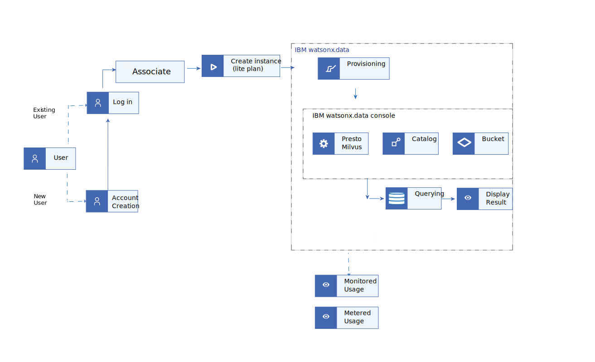

---

copyright:
  years: 2017, 2024
lastupdated: "2024-04-30"

keywords: watsonx.data, spark, analytics, provisioning
subcollection: watsonxdata

---

{{site.data.keyword.attribute-definition-list}}

# Working with Apache Hudi catalog
{: #hudi_nsp}

The topic describes the procedure to run a Spark application that ingests data into an Apache Hudi catalog.

1. Create a storage with Apache Hudi catalog to store data used in the Spark application. To create storage with Apache Hudi catalog, see [Adding a storage-catalog pair](watsonxdata?topic=watsonxdata-reg_bucket).
2. Associate the storage with the Native Spark engine. For more information, see [Associating a catalog with an engine](watsonxdata?topic=watsonxdata-asso-cat-eng).
3. Create Cloud Object Storage (COS) to store the Spark application. To create Cloud Object Storage and a bucket, see [Creating a storage bucket](https://cloud.ibm.com/docs/cloud-object-storage?topic=cloud-object-storage-secure-content-store#create-cos-bucket).
4. Register the Cloud Object Storage in watsonx.data. For more information, see [Adding a storage-catalog pair](watsonxdata?topic=watsonxdata-reg_bucket).
5. Save the following Spark application (Python file) to your local machine. Here, `hudi_demo.py`.

    The Python Spark application demonstrates the following functionality:
    * It creates a database inside the Apache Hudi catalog (that you created to store data). Here, hudi_db.
    * It creates a table inside the hudi_db database, namely hudi_table.
    * It inserts data into the hudi_table and does SELECT query operation.
    * It drops the table and schema after use.

    ```bash
        from pyspark.sql import SparkSession

        def init_spark():
            spark = SparkSession.builder \
                .appName("CreateHudiTableInCOS") \
                .enableHiveSupport() \
                .getOrCreate()
            return spark

        def main():

            try:
                spark = init_spark()
                spark.sql("show databases").show()
                spark.sql("create database if not exists spark_catalog.hudi_db LOCATION 's3a://hudi-connector-test/'").show()
                spark.sql("create table if not exists spark_catalog.hudi_db.hudi_table (id bigint, name string, location string) USING HUDI OPTIONS ('primaryKey' 'id', hoodie.write.markers.type= 'direct', hoodie.embed.timeline.server= 'false')").show()
                spark.sql("insert into hudi_db.hudi_table VALUES (1, 'Sam','Kochi'), (2, 'Tom','Bangalore'), (3, 'Bob','Chennai'), (4, 'Alex','Bangalore')").show()
                spark.sql("select * from spark_catalog.hudi_db.hudi_table").show()
                spark.sql("drop table spark_catalog.hudi_db.hudi_table").show()
                spark.sql("drop schema spark_catalog.hudi_db CASCADE").show()

            finally:
                spark.stop()

        if __name__ == '__main__':
            main()
    ```
    {: codeblock}

6. Upload the Spark application to the COS, see [Uploading data](https://cloud.ibm.com/docs/cloud-object-storage?topic=cloud-object-storage-secure-content-store#upload-data).
7. To submit the Spark application with data residing in Cloud Object Storage, specify the parameter values and run the following curl command


    ```bash
    curl --request POST \
    --url https://<wxd_host_name>/lakehouse/api/v2/spark_engines/<spark_engine_id>/applications \
    --header 'Authorization: Bearer <token>' \
    --header 'Content-Type: application/json' \
    --header 'LhInstanceId: <instance_id>' \
    --data '{
        "application_details": {
            "conf": {
            "spark.serializer" : "org.apache.spark.serializer.KryoSerializer",
            "spark.hadoop.fs.s3a.path.style.access" : "true",
            "spark.hive.metastore.client.plain.username":"ibmlhapikey",
            "spark.hive.metastore.client.plain.password":"<wxd_api_key>",
            "spark.driver.extraJavaOptions" : "-Dcom.sun.jndi.ldap.object.disableEndpointIdentification=true -Djdk.tls.trustNameService=true",
            "spark.executor.extraJavaOptions" : "-Dcom.sun.jndi.ldap.object.disableEndpointIdentification=true -Djdk.tls.trustNameService=true",

            "spark.kryo.registrator": "org.apache.spark.HoodieSparkKryoRegistrar",
            "spark.sql.catalog.spark_catalog.type": "hudi",
            "spark.sql.catalog.spark_catalog": "org.apache.spark.sql.hudi.catalog.HoodieCatalog",

            "spark.hadoop.wxd.cas.endpoint":"<cas_endpoint>/cas/v1/signature",
            "spark.hadoop.wxd.cas.apiKey":"<user-authentication-string>"

            },
            "application": "s3a://hudi-connector-test/hudi_demo.py"
        }
    }
    ```
    {: codeblock}

Parameter values:
* `<wxd_host_name>`: The hostname of your watsonx.data Cloud instance.
* `<instance_id>`: The instance ID from the watsonx.data instance URL. For example, 1609968977179454.
* `<spark_engine_id>`: The Engine ID of the native Spark engine.
* `<token>`: The bearer token. For more information about generating the token, see [IAM token](https://test.cloud.ibm.com/docs/watsonxdata?topic=watsonxdata-con-presto-serv#get-ibmiam-token).
* `<wxd_api_key>`: To generate API key, log in into the watsonx.data console and navigate to Profile > Profile and Settings > API Keys and generate a new API key.
* `<cas_endpoint>`: The CAS endpoint. To generate CAS endpoint, see [Content Aware Storage (CAS) endpoint](watsonxdata?topic=watsonxdata-cas_ep).
* `<user-authentication-string>`: The value must be in the format : `base64 encoding(ibmlhapikey_<wxd-user-name>:<user_apikey>)`. To generate API key, log in into the watsonx.data console and navigate to Profile > Profile and Settings > API Keys and generate a new API key.
 If you generate a new API key, your old API key becomes invalid. If you generate the encoded string from a Mac machine, remove last 4 characters from resulted string.
 {: note}


8. After you submit the Spark application, you receive a confirmation message with the application ID and Spark version. Save it for reference.
9. Log in to the watsonx.data cluster, access the Engine details page. In the Applications tab, use application ID to list the application and track the stages. For more information, see [View and manage applications](watsonxdata?topic=watsonxdata-mng_appltn).


<!--

Simple tab table
{: #simple-tab-table-test}

Product Management Role	Actions	Example Actions for {{site.data.keyword.containershort_notm}}
Viewer	Can view service instances, but can't modify them	List clusters
Editor	Perform all platform actions except for managing the account and assigning access policies	Bind a service to a cluster
Operator	Perform platform actions required to configure and operate service instances, such as viewing a service's dashboard	Add or remove worker nodes
Administrator	Perform all platform actions based on the resource this role is being assigned, including assigning access policies to other users	Remove a cluster
{: class="simple-tab-table"}
{: caption="Table 1. IAM roles" caption-side="bottom"}
{: #simpletabtable1}
{: tab-title="Product Management Roles"}
{: tab-group="IAM-simple"}
Access Policy Details	Actions for Service IDs	Actions for Managing Access Groups
Editor role	Create, update, and delete IDs and API keys	View, create, edit, and delete groups
Operator role	Create, update, and delete IDs and API keys	Assign access policies to IDs
Viewer role	View IDs and API keys	View IDs and API keys
{: caption="Table 2. IAM roles - Access" caption-side="bottom"}
{: #simpletabtable2}
{: tab-title="Developer roles"}
{: tab-group="IAM-simple"}
{: class="simple-tab-table"}
Platform Management Role	Actions	Example Actions for {{site.data.keyword.containershort_notm}}
Viewer	Can view service instances, but can't modify them	List clusters
Editor	Perform all platform actions except for managing the account and assigning access policies	Bind a service to a cluster
Operator	Perform platform actions required to configure and operate service instances, such as viewing a service's dashboard	Add or remove worker nodes
{: caption="Table 3. IAM roles - Platform management" caption-side="bottom"}
{: #simpletabtable3}
{: tab-title="Management roles"}
{: tab-group="IAM-simple"}
{: class="simple-tab-table"}
Service Access Role	Actions	Example Actions for {{site.data.keyword.containershort_notm}}
Reader	Perform read-only actions within a service, such as viewing service-specific resources	List and download objects
Writer	Permissions beyond the reader role, including creating and editing service-specific resources	Create and destroy buckets and objects
Manager	Permissions beyond the writer role to complete privileged actions as defined by the service, plus create and edit service-specific resources	Manage all aspects of data storage, create and destroy buckets and objects
{: caption="Table 4. IAM roles - Service" caption-side="bottom"}
{: #simpletabtable4}
{: tab-title="Reader Role"}
{: tab-group="IAM-simple"}
{: class="simple-tab-table"}
Space role	Permissions	Example Actions for {{site.data.keyword.containershort_notm}}
Manager	Space managers can add existing users and manage roles within the space. The space manager can also view the number of instances, service bindings, and resource use for each application in the space.	List and download objects
Developer	Space developers can create,delete, and manage applications and services within the space. Some of the managing tasks include deploying apps, starting or stopping apps, renaming an app, deleting an app, renaming a space, binding or unbinding a service to an application, viewing the number or instances, service bindings, and resource usage for each application in the space. In addition, the space developer can associate an internal or external URL with an application in the space.	Create and destroy buckets and objects
Auditor	Space auditors have read-only access to all information about the space, such as information about the number of instances, service bindings, and resource use for each application in the space.	Add or remove worker nodes
{: caption="Table 5. IAM roles - Service" caption-side="bottom"}
{: #simpletabtable5}
{: tab-title="Manager Role"}
{: tab-group="IAM-simple"}
{: class="simple-tab-table"}
Migrated Permission Access Group Name	Description	{{site.data.keyword.cloud_notm}} service	IAM role
View account summary	View the account summary page and invoices and payments	Billing	Viewer
Get compliance report	Request compliance reports	Billing	Viewer
Edit company profile	Edit the company profile information	Billing	Operator
Update payment details	Update the recurring monthly payment information	Billing	Operator
Limit EU case restriction	Enable or disable the EU Supported option that restricts support case data to the European Union	Billing	Operator
Add cases and view orders	Create support cases and see all orders.	Support Center	Editor
Edit cases	Edit any support case	Support Center	Editor
Search cases	Search all support cases as long as the view cases permission is also assigned	Support Center	Viewer
View cases	View all support cases	Support Center	Viewer
{: caption="Table 6. IAM roles - Migrated Permission Access" caption-side="bottom"}
{: #simpletabtable6}
{: tab-title="Account Role"}
{: tab-group="IAM-simple"}
{: class="simple-tab-table"}


{: caption="Figure 1. Workflow diagram" caption-side="bottom"} -->
