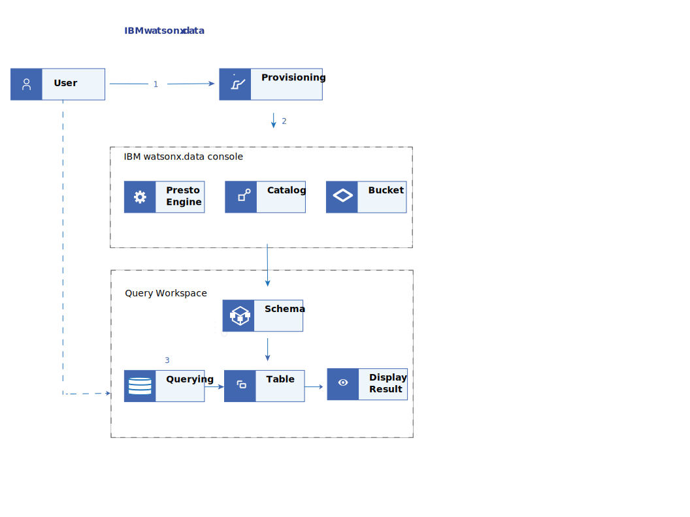

---

copyright:
  years: 2022, 2024
lastupdated: "2024-01-31"

keywords: provisioning, query, engine, infrastructure

subcollection: watsonxdata

content-type: tutorial
account-plan: paid
completion-time: 8h

---

{{site.data.keyword.attribute-definition-list}}


{:step: data-tutorial-type="step"}
{:shortdesc: .shortdesc}

# Setting up infrastructure and querying data
{: #tutorial_prov_custbckt}
{: toc-content-type="tutorial"}
{: toc-completion-time="8h"}

In this tutorial, you learn to provision the {{site.data.keyword.lakehouse_full}} instance with a Presto engine, catalog, and a bucket. You also explore how the {{site.data.keyword.lakehouse_short}} service interacts with the data you bring in.
{: shortdesc}

**Sample Scenario** : Your team is working on developing an automated data pipeline that requires querying data from the data bucket that you have. Your manager requests you to retrieve data from the data bucket by using the {{site.data.keyword.lakehouse_short}} instance.

For this scenario, you must create the Presto query engine, establish connection, read data from the data bucket and display the result in {{site.data.keyword.lakehouse_short}} instance.

This scenario assumes that you already have a data bucket that is associated with data for querying.
{: note}


## Objective
{: #custbckt_obj}

* Creating infrastructure within the {{site.data.keyword.lakehouse_short}} service.

* Establishing connection with the customer data bucket.

* Querying from the bucket

{: caption="Figure 1. Workflow diagram" caption-side="bottom"}

## Before you begin
{: #custbckt_byb}

This tutorial requires:

* Subscription of {{site.data.keyword.lakehouse_short}} on cloud.
* The configuration details of data bucket that you bring in. This is required for establishing connetion with the {{site.data.keyword.lakehouse_short}}.
* Ensure that the data bucket has data.


## Provisioning {{site.data.keyword.lakehouse_short}} service instance
{: #custbckt_stp1}
{: step}

In this section of the tutorial, you are going to deploy a {{site.data.keyword.lakehouse_short}} service, create a {{site.data.keyword.lakehouse_short}} service instance from the service's catalog page or by specifying the service ID to the command line or to the API.
{: shortdesc}

1. Log in to the [IBM Cloud console](https://cloud.ibm.com).
1. Click **Catalog**. The list of services appears.
1. To filter the list of services that are displayed, select the **Databases** category.
1. Click the **{{site.data.keyword.lakehouse_short}}** tile. The service provisioning page opens.

1. Select {{site.data.keyword.Bluemix_short}} as the cloud platform to deploy {{site.data.keyword.lakehouse_short}}.

2. Select a location from the list of available locations for {{site.data.keyword.lakehouse_short}} service.

1. Enter the service name. The service name can be any string. This service name is used in the web console and in the command line to identify the new deployment.

2. Select a resource group. If you are organizing your services into resource groups, specify the resource group.

3. Enter a tag name.

1. Select the type of network endpoints that will be used to access the service.

   a. **Public endpoint only** - Public endpoints provide a connection to your deployment on the public network (single endpoint).

   b. **Private endpoint only** - Private endpoints route traffic through the IBM Cloud Private network (single endpoint).

   c. **Both public and private endpoints** - Public endpoints provide a connection to your deployment on the public network. Private endpoints route traffic through the IBM Cloud Private network. (two separate endpoints).

2. After selecting the appropriate settings, click **Create** to start the provisioning process. The **Resource List** page opens with the **{{site.data.keyword.lakehouse_short}}** service that is listed under **Databases**.


## Connecting to web console
{: #custbckt_stp2}
{: step}

After creating the {{site.data.keyword.lakehouse_short}} instance, you need to log in to the {{site.data.keyword.lakehouse_short}} web console. Complete the following steps:
{: shortdesc}

1. Log in to your IBM Cloud Account.
2. Go to **Resource list** **>** **Databases**.
3. Click your {{site.data.keyword.lakehouse_short}} instance link. The service instance page opens.
4. Click the **Open web console** button to start the web console.
5. Log in to the console with your IBM ID and password.

## Adding infrastructure
{: #custbckt_stp3}
{: step}

When you log in to the {{site.data.keyword.lakehouse_short}} web console for the first time, you are presented with the quick start wizard.
{: shortdesc}

Use the quick start wizard to configure the basic settings and get started with {{site.data.keyword.lakehouse_short}} in a few minutes.

In this section of the tutorial, you perform the following:
* Register the details of the object storage bucket that you bring in.
* Add the metadata catalogs (Iceberg catalog) to manage your table schemas.
* Select the query engine to work with your data.


Complete the following steps:

1. In the **Bucket configuration** page, select **Register my own** option and provide the following details to register your data bucket.

   | Field | Description |
      |--------------------------|----------------|
      | Type | Select from Amazon S3 or IBM Cloud Object Storage.|
      | Name | Enter your bucket name.|
      | Endpoint | Enter the endpoint URL.|
      | Access key | Enter your access key. |
      | Secret key | Enter your secret key. |
      {: caption="Table 1. Add bucket " caption-side="bottom"}

   When you register your own bucket, ensure to provide the correct details for bucket configuration. Quick start wizard does not validate the bucket configuration details and you cannot modify them later.
      {: note}

   Ensure that the data bucket contains data.
   {: note}

2. Click **Next**. This displays the **Catalogs configuration** page.
3. In the **Catalogs configuration** page, select Apache Iceberg.
4. Click **Next**. This displays the **Engine configuration** page.
5. In the **Engine configuration** page, select the engine type and size.

   Depending on the workload that you have, you can select the type and size of the Presto engine.
   {: note}

6. Click **Next**. This displays the **Summary** page.
7. In the **Summary** page, review the configurations before you finish setting up your data infrastructure.

   When the setup is complete, the {{site.data.keyword.lakehouse_short}} home page is displayed.
   You are all set to use the {{site.data.keyword.lakehouse_short}} or you can configure it further.

8. Click **Finish and go**. This displays the **Infrastructure manager** page.

You can add more engines, catalogs, buckets, and databases in the **Infrastructure manager** page if you want to. For more information about creating engines, catalogs, buckets, databases, see Configuring watsonx.data components in the How To section.
_______

## Querying data
{: #custbckt_stp4}
{: step}

In this section of the tutorial, you learn how to navigate to the **Query workspace**, and create SQL queries to query your data from the bucket.
{: shortdesc}

To run the SQL queries, do the following steps:

1. From the navigation menu, select **SQL**.  The **Query workspace** page opens.
2. Select the Presto engine from the **Engine** drop-down.
3. Select the catalog. In this scenario, consider the **Apache Iceberg** catalog, **default** schema, **order_detail** table, to run the query.
4. Click the overflow menu and select the required query.
   * For a catalog and schema, you can run the Generate Path query.
   * For a table, you can run the Generate path, Generate SELECT, Generate ALTER, and Generate DROP query.
   * For a column, you can run the Generate path, Generate SELECT, and Generate DROP query.

   Consider the following sample query to view the details from **iceberg-beta**:

   Example:

   ```bash
   #!/bin/bash
   SELECT * FROM "iceberg-beta"."default"."order_detail" LIMIT 10;
   ```
   {: codeblock}

5. Click the **Run on** button to run the query.
6. Select **Result set** or **Details** tab to view the results. If required, you can save the query.
7. Click **Saved queries** to view the saved queries.
8. Click [**Explain**](watsonxdata?topic=watsonxdata-explain_sql_query){: external} to view the logical or distributed plan of execution for a specified SQL query.
