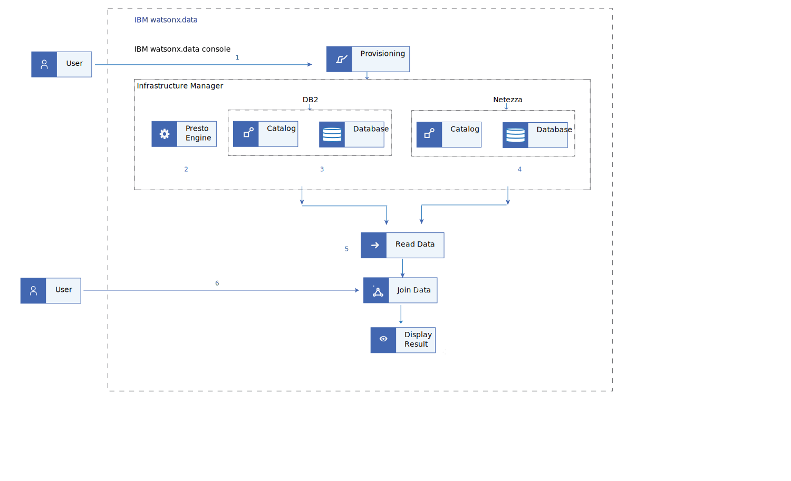

---

copyright:
  years: 2022, 2023
lastupdated: "2023-07-07"

keywords: Joining, query, table, infrastructure

subcollection: watsonxdata

content-type: tutorial
account-plan: paid
completion-time: 9h
---

{{site.data.keyword.attribute-definition-list}}

{:shortdesc: .shortdesc}
{:step: data-tutorial-type="step"}


# Joining data from different data source by using {{site.data.keyword.lakehouse_short}}
{: #tutorial_join_data}
{: toc-content-type="tutorial"}
{: toc-completion-time="9h"}

In this tutorial, you learn how to set up two data sources, Db2 and Netezza in your {{site.data.keyword.lakehouse_full}} instance and to analyse the combined data from these sources.
{: shortdesc}

**Sample Scenario** : You are the Data Engineer for your company. The company stores the sales data in Db2 Warehouse whereas, the customer data resides in Netezza. Your task is to combine and analyze the two data sets and gain knowldege about the customer behaviour.
In this scenario, you explore the process of obtaining data from two seperate data sources, combining them, and creating a comprehensive view in {{site.data.keyword.lakehouse_short}} instance.

## Objective
{: #ibmbckt_obj}

* Setting up Db2 and Neteeza data source
* Ingesting data
* Joining data from Db2 and Neteeza

{: caption="Figure 1. Workflow diagram" caption-side="bottom"}


## Before you begin
{: #ibmbckt_bfb}

This tutorial requires:

* Subscription of {{site.data.keyword.lakehouse_short}} on cloud.

## Provisioning {{site.data.keyword.lakehouse_short}} service instance
{: #ibmbckt_stp1}
{: step}

In this section of the tutorial, you are going to deploy a {{site.data.keyword.lakehouse_short}} service, create a {{site.data.keyword.lakehouse_short}} service instance from the service's catalog page or by specifying the service ID to the command line or to the API.
{: shortdesc}

1. Log in to the [IBM Cloud console](https://cloud.ibm.com).
1. Click **Catalog**. The list of services appears.
1. To filter the list of services that are displayed, select the **Databases** category.
1. Click the **{{site.data.keyword.lakehouse_short}}** tile. The service provisioning page opens.

1. Select {{site.data.keyword.Bluemix_short}} as the cloud platform to deploy {{site.data.keyword.lakehouse_short}}.

2. Select a location from the list of available locations for {{site.data.keyword.lakehouse_short}} service.

1. Enter the service name. The service name can be any string. This service name is used in the web console and in the command line to identify the new deployment.

2. Select a resource group. If you are organizing your services into resource groups, specify the resource group.

3. Enter a tag name.

1. Select the type of network endpoints that is used to access the service.

   a. **Public endpoint only** - Public endpoints provide a connection to your deployment on the public network (single endpoint).

   b. **Private endpoint only** - Private endpoints route traffic through the IBM Cloud Private network (single endpoint).

   c. **Both public and private endpoints** - Public endpoints provide a connection to your deployment on the public network. Private endpoints route traffic through the IBM Cloud Private network. (two separate endpoints).

2. After selecting the appropriate settings, click **Create** to start the provisioning process. The **Resource List** page opens with the **{{site.data.keyword.lakehouse_short}}** service that is listed under **Databases**.


## Connecting to web console
{: #ibmbckt_stp2}
{: step}

After creating the {{site.data.keyword.lakehouse_short}} instance, you need to log in to the {{site.data.keyword.lakehouse_short}} web console. Complete the following steps:
{: shortdesc}

1. Log in to your IBM Cloud Account.
2. Go to **Resource list** **>** **Databases**.
3. Click your {{site.data.keyword.lakehouse_short}} instance link. The service instance page opens.
4. Click the **Open web console** button to start the web console.
5. Log in to the console with your IBM ID and password.

## Adding a Presto engine
{: #ibmbckt_step3}
{: step}

After you log in to the {{site.data.keyword.lakehouse_short}} web console, you are on the home page.
The home page provides information about the logged in user, the login timestamp, and region where the {{site.data.keyword.lakehouse_short}} is created.
In this part of the tutorial, you learn how to navigate to the **Infrastructure manager** page where you can design your {{site.data.keyword.lakehouse_short}} by provisioning engines, catalogs, and databases.
{: shortdesc}

This scenario assumes that it is not the first log in attempt to {{site.data.keyword.lakehouse_short}} web console.
{: note}

To create a Presto engine, complete the following steps:

2. From the navigation menu, select **Infrastructure manager**.

3. To provision an engine, click **Add component** and select **Create engine**.

4. In the **Create engine** window, provide the following details to a sign up new compute to work with your data.

   | Field | Description |
   |--------------------------|----------------|
   | Name | Enter your compute engine name. |
   | Type | Select Presto v0.279. |
   | Size | Select the required size based on whether your workload is compute intense or storage intense. |
   | Description (optional) | Describe the intended purpose of engine. |
   | Tags (optional) | Enter the tag name or select from drop-down list. |
   | Associate catalogs | If required, you can associate a catalog. |
   {: caption="Table 1. Provision engine" caption-side="bottom"}

5. Click **Create**. The engine is created.

## Adding database
{: #ibmbckt_stp4}
{: step}

Next, you learn the steps to setup the two specific databases, Db2 and Netezza, which serves as the source of data for information retrieval.
{: shortdesc}

1. From the navigation menu, select **Infrastructure manager**.
3. To add a database, click **Add component** and select **Add database**.
4. In the **Add database** form, select **IBM Db2** from the database type drop-down menu to create Db2 database.

   Select **IBM Netezza** from the database type drop-down menu to create Netezza database.
   {: note}

5. Specify the following details:

   The database name must be unique. Two databases having the same name cannot be added.
   {: note}

   | Field | Description |
   |--------------------------|----------------|
   | Name | Enter the name of your database.|
   | Description (optional) | Describe the databse.|
   | Tags (optional) | Enter the tag name or select from drop-down list.|
   {: caption="Table 1. Register database" caption-side="bottom"}

   Based on the database you are adding, enter related details in appropriate fields. For example, hostname, username, and password. For more information, see [Db2 connector](watsonxdata?topic=watsonxdata-db2_connector){: external} details and [Netezza connector](watsonxdata?topic=watsonxdata-netezza_connector){: external} details.

   When the **SSL Connection** is selected, the server-side certificate that is used by the database must be issued by one of the global trusted certification authorities (CA) such as DigiCert. This is a typical case for cloud-hosted databases.
   {: note}

5. Click **Add**.

## Associating with engine
{: #ibmbckt_stp5}
{: step}

You must link the Db2 and Netezza databases to the Presto engine that is used to process the data.
{: shortdesc}

To associate Db2 with the Presto engine, do the following steps:

1. From the **Infrastructure manager**, select Db2 database. Click the overflow menu icon at the end of the row and click **Associate**.
2. In the **Associate with engine** form, select the Presto engine that you want to use to process the data.
3. Click **Associate and restart engine**. The Db2 database is associated with the Presto engine.

Similarly, select the Netezza database and link it to the Presto engine.
{: note}

## Explore the data
{: #ibmbckt_stp6}
{: step}

In this section of the tutorial, you learn how to load the data into the catalog.
{: shortdesc}

1. In the {{site.data.keyword.lakehouse_short}} console, select **Data manager** from the navigation menu.
1. Select the Presto engine from the **Engine** drop-down. The catalogs that are associated with the selected engine are displayed.
1. Select the **Db2** catalog and follow the steps to [create a schema](watsonxdata?topic=watsonxdata-create_schema){: external}.
    1. Select the schema that you created now. Click the **Create** drop-down and select **Create table**. The **Create ingestion job** page appears.

    1. In the **Create ingestion job** page, drag the files to the rectangle box or click to upload.

    2. If required, make the necessary changes in the **Configure** options section and click **Next**. You can also preview the file being uploaded.
    3. In the **Target** form, select the Presto query engine, the target table, Db2 catalog, and schema for the file you are ingesting.
    4. Enter a name for the table in the **Table** field and click **Next**.
    5. Verify the details in the **Summary** page and click **Ingest**.

1. Select the **Netezza** catalog and repeat the sub steps (from a to e) to create a schema and table for Netezza.

## Combine data
{: #ibmbckt_stp7}
{: step}

You can also navigate to the **Query workspace** to create SQL queries to query your data.
{: shortdesc}

To run the SQL query to join two tables, do the following steps:

1. From the navigation menu, select **SQL**. The **Query workspace** page opens.
2. Select the Presto engine from the **Engine** drop-down.
4. Click the overflow menu and select the required query.
   * For a catalog and schema, you can run the Generate Path query.
   * For a table, you can run the Generate path, Generate SELECT, Generate ALTER, and Generate DROP query.
   * For a column, you can run the Generate path, Generate SELECT, and Generate DROP query.

   Consider the following sample query to join the details from **Db2** and **Netezza**:

   Example:

   ```bash
   #!/bin/bash
   SELECT * FROM "Db2"."default"."order_detail" AS details
   LEFT JOIN "Netezza"."gosales"."order_detail" AS header
   ON details.order_number=header.order_number
   LIMIT 10;
   ```
   {: codeblock}

5. Click the **Run on** button to run the query.
6. Select **Result set** or **Details** tab to view the combined result. If required, you can save the query.
7. Click **Saved queries** to view the saved queries.
8. Click [**Explain**](watsonxdata?topic=watsonxdata-explain_sql_query){: external} to view the logical or distributed plan of execution for a specified SQL query.
