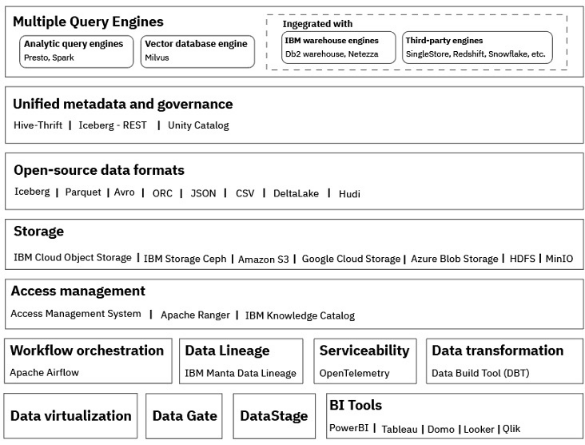

---

copyright:
  years: 2022, 2024
lastupdated: "2025-02-26"

keywords: lakehouse, milvus, watsonx.data

subcollection: watsonxdata

---

{:javascript: #javascript .ph data-hd-programlang='javascript'}
{:java: #java .ph data-hd-programlang='java'}
{:ruby: #ruby .ph data-hd-programlang='ruby'}
{:php: #php .ph data-hd-programlang='php'}
{:python: #python .ph data-hd-programlang='python'}
{:external: target="_blank" .external}
{:shortdesc: .shortdesc}
{:codeblock: .codeblock}
{:screen: .screen}
{:tip: .tip}
{:important: .important}
{:note: .note}
{:deprecated: .deprecated}
{:pre: .pre}
{:video: .video}

# {{site.data.keyword.lakehouse_full}} overview
{: #wxd_ov}

{{site.data.keyword.lakehouse_full}} is a hybrid, open data lakehouse to power AI and analytics with all your data anywhere. It combines the elements of the data warehouse and data lakes to bring the best-in-class features and optimizations making {{site.data.keyword.lakehouse_short}} it an optimal choice for next generation AI, data analytics and automation.

It helps your organization to break down data silos and unlock value without business disruption, there by unifying all your data for AI and analytics. It also augments your current data investments with an open modern data stack.

It allows co-existence of open-source technologies and proprietary products and offers a single platform where you can store the data or attach your current data sources for managing and analyzing your enterprise data. Attaching your data sources helps to reduce data duplication and cost of storing data in multiple places.

It uses open data formats with APIs and machine learning libraries, making it easier for data scientists and data engineers to use the data. architecture enforces schema and data integrity, making it easier to implement robust data security and governance mechanisms.

You can use {{site.data.keyword.lakehouse_short}} to store any type of data (structured, semi-structured, and unstructured) and make that data accessible directly for Artificial Intelligence (AI) and Business Intelligence (BI). It uses open data formats with APIs and machine learning libraries, making it easier for data scientists and data engineers to use the data. {{site.data.keyword.lakehouse_short}} architecture enforces schema and data integrity, making it easier to implement robust data security and governance mechanisms.

## Key features
{: #wxd_keyfeat1}

- An architecture that fully separates compute, metadata, and storage to offer ultimate flexibility.
- Multiple engines such as Presto (Java), Presto (C++), Spark, and Milvus for different use cases that provide fast, reliable, and efficient processing of big data at scale.
- Open formats for analytic data sets, allowing different engines to access and share the data at the same time.
- Data sharing between {{site.data.keyword.lakehouse_short}}, Db2® Warehouse, and Netezza Performance Server or any other data management solution through common Iceberg table format support, connectors, and a shareable metadata store.
- Built-in governance that is compatible with existing solutions, including IBM Knowledge Catalog and Apache Ranger.
- Cost-effective, simple object storage available across hybrid-cloud and multi-cloud environments.
- Integration with a robust ecosystem of IBM’s best-in-class solutions and third-party services to enable easy development and deployment of key use cases.

## Deployment options
{: #dplymnt}

{{site.data.keyword.lakehouse_short}}  is available with the following deployment options:

- Software – The on-prem version of {{site.data.keyword.lakehouse_short}} can be deployed on IBM Software Hub. For more details, see [IBM {{site.data.keyword.lakehouse_short}} on IBM Software Hub](https://www.ibm.com/docs/en/watsonx/watsonxdata/2.1.x?topic=software).
- SaaS – The SaaS version of {{site.data.keyword.lakehouse_short}} can be deployed on IBM Cloud or AWS cloud. For more details, see:
   - [IBM Cloud](https://test.cloud.ibm.com/docs/watsonxdata)
   - [AWS](https://www.ibm.com/docs/en/watsonx/watsonxdata/aws)
- Developer – The Developer version is an entry-level {{site.data.keyword.lakehouse_short}} for the students, developers and partner community. For more details, see [Setting up {{site.data.keyword.lakehouse_short}} developer edition](https://www.ibm.com/docs/en/watsonx/watsonxdata/2.1.x?topic=developer-edition)

## {{site.data.keyword.lakehouse_short}} components
{: #cmpnt}

The following diagram is a high-level depiction of {{site.data.keyword.lakehouse_short}} and its components.

{: caption="watsonx.data components" caption-side="bottom"}
